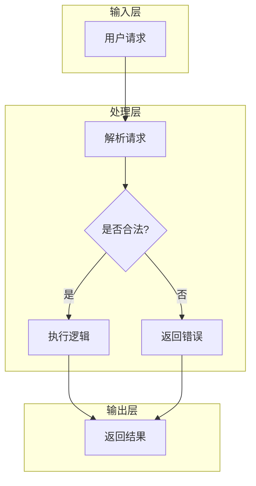
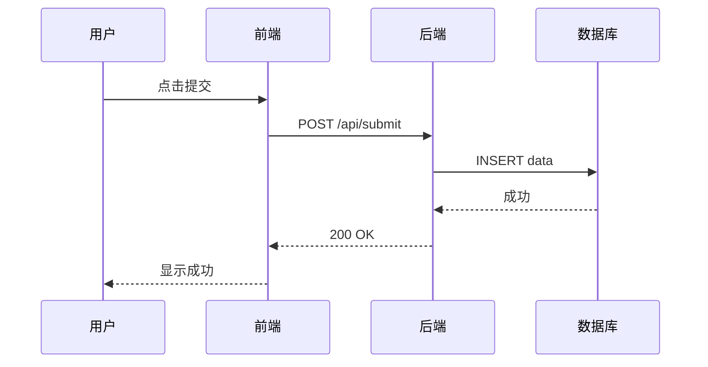
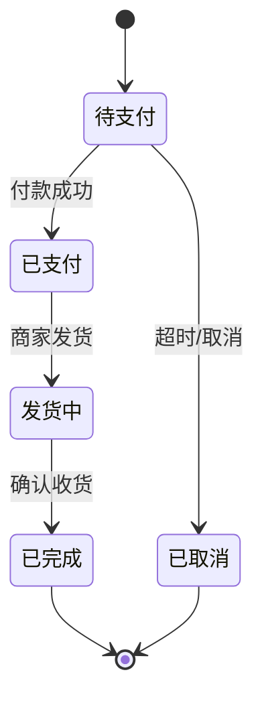
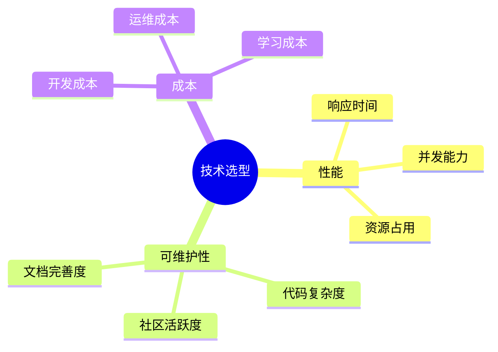
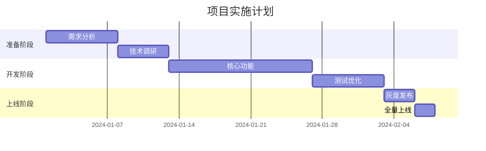

# 技术宣讲稿生成器

## 作用

从大量分散的技术文档中，生成结构清晰、证据充分、适合混合听众的技术宣讲大纲和稿子。

**核心挑战**：
- 信息过载 → 精选最有价值的内容
- 避免失真 → 保留关键细节，不为了易懂而牺牲准确性
- 混合听众 → 新手听得懂，专家不觉得浅

## 何时触发

**应该触发**：
- "帮我准备一个关于 X 的技术分享"
- "我有很多文档，想整理成一个宣讲"
- "下周要给团队讲 X，帮我准备材料"
- 用户提供多篇文档并提到"宣讲/分享/汇报/演讲"

**不应该触发**：
- 单篇论文深度阅读 → 用 paper-reading
- 开源项目教程生成 → 用 tutorial-generator
- 只需要文档摘要，不需要宣讲材料

---

## 工作流程（四阶段，多轮交互）

```
Phase 1: 文档分析 → 生成信息地图 → [确认]
Phase 2: 主线设计 → 提出主线选项 → [选择]
Phase 3: 大纲生成 → 输出结构大纲 → [确认]
Phase 4: 稿子展开 → 完整宣讲稿
```

---

## Phase 1: 文档分析

### 1.1 信息提取

从每篇文档中提取：

```
文档清单：
├── doc1: [标题/来源]
│   ├── 核心观点: [1-3 个要点]
│   ├── 关键数据: [数字/指标]
│   ├── 有价值的案例: [具体例子]
│   └── 可引用的原话: [金句/定义]
├── doc2: ...
└── doc3: ...
```

### 1.2 信息整合

**观点聚类**：将相似观点归类

```
主题 A: [主题名]
├── 观点 1 (doc1, doc3)
├── 观点 2 (doc2)
└── 冲突点: doc1 认为 X，doc4 认为 Y

主题 B: [主题名]
└── ...
```

**冲突识别**：明确标记文档间的分歧

```
[分歧点 1] 关于 X 的看法
- doc1: 认为 X 是趋势
- doc4: 认为 X 有局限性
- 分析: 可能是因为视角/时间/场景不同
```

**演化追踪**：如果文档有时间跨度

```
时间线：
2022: [早期观点]
2023: [中期发展]
2024: [最新状态]
```

### 1.3 生成信息地图

用 ASCII 图展示文档间的关系：

```
        ┌─────────────────────────────────────┐
        │           核心主题: X                │
        └──────────────┬──────────────────────┘
                       │
        ┌──────────────┼──────────────┐
        │              │              │
        ▼              ▼              ▼
   ┌─────────┐   ┌─────────┐   ┌─────────┐
   │ 子主题 A │   │ 子主题 B │   │ 子主题 C │
   │ doc1,2,3│   │ doc2,4  │   │ doc5,6  │
   └────┬────┘   └────┬────┘   └────┬────┘
        │              │              │
        ▼              ▼              ▼
   [证据链]        [证据链]        [证据链]
```

### 1.4 交互确认

输出信息地图后，询问用户：
- "这些主题的划分是否符合你的预期？"
- "有没有想重点讲/不想讲的部分？"
- "听众最关心什么？"

---

## Phase 2: 主线设计

### 2.1 主线类型

根据文档内容，提出 2-3 个可能的主线：

**类型 A: 问题驱动**
```
"为什么 X 是个问题 → 现有方案有什么不足 → 新方案是什么 → 效果如何"

适用：解决具体技术问题、引入新工具/方法
```

**类型 B: 演进驱动**
```
"X 从哪里来 → 经历了什么变化 → 现在到哪了 → 未来可能去哪"

适用：技术发展史、行业趋势、版本演进
```

**类型 C: 对比驱动**
```
"方案 A 是什么 → 方案 B 是什么 → 各自优劣 → 什么时候选哪个"

适用：技术选型、方案比较、架构决策
```

**类型 D: 实践驱动**
```
"我们遇到了什么问题 → 尝试了什么 → 踩了什么坑 → 最终怎么解决的"

适用：项目复盘、踩坑分享、最佳实践
```

### 2.2 主线选择建议

根据文档内容自动判断适合的主线：

```
文档特征 → 推荐主线
- 有明确问题和解决方案 → 问题驱动
- 有时间跨度/版本演进 → 演进驱动
- 有多个方案对比 → 对比驱动
- 有实际项目经验 → 实践驱动
- 混合特征 → 建议组合使用
```

### 2.3 交互确认

输出主线选项后，让用户选择：
- "我建议用 [X] 主线，因为文档中 [理由]"
- "或者你也可以选 [Y] 主线，这样会 [效果]"
- "你倾向哪个方向？或者有其他想法？"

---

## Phase 3: 大纲生成

### 3.1 宣讲结构模板

```markdown
# [宣讲标题]

## 开场 (5-10%)
- 钩子：用一个具体场景/问题/数据开场
- 背景：为什么这个话题重要
- 预告：今天会讲什么

## 核心内容 (70-80%)
### 部分 1: [主题] (X 分钟)
- 要点 1
- 要点 2
- [互动/提问]

### 部分 2: [主题] (X 分钟)
- ...

### 部分 3: [主题] (X 分钟)
- ...

## 互动环节 (5-10%)
- 讨论问题
- Q&A 预设问题

## 结尾 (5%)
- 核心要点回顾
- 行动建议/后续步骤
- 参考资料
```

### 3.2 时间分配

根据宣讲总时长和内容量建议：

```
30 分钟分享：
- 开场: 2-3 分钟
- 核心: 20-25 分钟 (2-3 个部分)
- 互动: 3-5 分钟
- 结尾: 2 分钟

60 分钟分享：
- 开场: 3-5 分钟
- 核心: 40-45 分钟 (3-4 个部分)
- 互动: 8-10 分钟
- 结尾: 3-5 分钟
```

### 3.3 混合听众适配

为不同水平听众设计分层内容：

```
结构：
├── 主线内容（通用层）：所有人都能理解
│
├── [背景框]（新手层）：补充基础概念
│   └── "如果你不熟悉 X，简单说就是..."
│
└── [深入框]（专家层）：技术细节和延伸
    └── "从技术角度看，这里的关键是..."
```

### 3.4 交互确认

输出大纲后，询问用户：
- "这个结构是否符合预期？"
- "时间分配是否合理？需要调整吗？"
- "有没有想加/减的部分？"

---

## Phase 4: 稿子展开

### 4.1 避免失真的双重保护

**保护机制 A: 强制证据链**

每个关键论点必须包含：

```markdown
## 论点: X 方法可以提升效率

**证据 1**: [数据支撑]
> "使用 X 方法后，处理时间从 5 秒降到 0.5 秒"
> — [来源: doc1, 性能测试章节]

**证据 2**: [案例支撑]
> "Y 项目在 2023 年引入了 X 方法，效果是..."
> — [来源: doc3, 案例研究]

**证据 3**: [原理支撑]
> "X 方法之所以有效，是因为..."
> — [来源: doc2, 技术原理]
```

**保护机制 B: 风险标记**

在简化处明确标记：

```markdown
### 简化警告标记

[简化] 这里用类比解释了 X 概念，省略了数学证明。
       如果听众追问细节，可以补充: [具体细节]

[权衡] 为了让新手理解，这里略过了 Y 的实现细节。
       完整讨论见 [来源: doc2, 第 3 章]

[争议] 关于这一点，文档 A 和 B 有不同看法。
       这里采用 A 的观点，因为 [理由]
       B 的观点是 [简述]，适合 [场景] 的听众
```

### 4.2 稿子结构

```markdown
# [宣讲标题]
> 预计时长: X 分钟 | 目标听众: [描述]

---

## 开场 (X 分钟)

### 钩子
[用一个具体场景/问题/数据开场]

> "上周我们遇到了一个问题..." 或
> "你们知道 X 每年造成多少损失吗？" 或
> "想象一下，如果..."

### 背景与重要性
[为什么这个话题值得花时间听]

> [证据: 来源引用]

### 今天会讲什么
[预告结构，让听众有预期]

---

## 核心内容

### 部分 1: [标题] (X 分钟)

#### 要点 1.1
[展开说明]

> [证据/引用: 来源]

[背景框]: 如果听众不熟悉 X...
> 简单解释...

[深入框]: 从技术角度看...
> 详细说明...

#### 要点 1.2
...

[简化] 这里省略了 Y，细节见 [来源]

---

### 部分 2: [标题] (X 分钟)
...

---

## 互动环节 (X 分钟)

### 讨论问题
1. [预设问题 1]
2. [预设问题 2]

### 可能的 Q&A
Q: [听众可能问的问题]?
A: [准备好的回答]

---

## 结尾 (X 分钟)

### 核心要点回顾
- 要点 1
- 要点 2
- 要点 3

### 行动建议
[听完之后，听众可以做什么]

### 参考资料
- [文档 1]
- [文档 2]
- [延伸阅读]
```

### 4.3 讲稿风格指南

**语言风格**：
- 口语化，但保持专业
- 用"我们"而不是"你们"，建立共鸣
- 适当使用设问，引导听众思考

**节奏控制**：
- 每 5-10 分钟有一个小高潮或互动
- 复杂概念后紧跟简单例子
- 数据和故事交替使用

**过渡语示例**：
- "说到这里，你可能会想..."
- "这个问题在 [某项目] 中是怎么解决的呢？"
- "理解了 X 之后，我们再来看看 Y..."
- "有意思的是..."

---

## 可视化工具箱

宣讲稿中的可视化元素能大幅提升理解和记忆效果。以下是推荐的可视化形式和使用场景。

### 1. Mermaid 图指南

Mermaid 图可以在 Markdown 中渲染为流程图、时序图等，适合展示结构化信息。

#### 1.1 流程图 (flowchart)

**适用场景**：流程、决策树、架构分层



**宣讲中的用法**：
```markdown
### 系统架构

整体流程分为三层：


- **网关层**：负责认证和限流
- **服务层**：核心业务逻辑
- **数据层**：持久化存储
```

#### 1.2 时序图 (sequenceDiagram)

**适用场景**：交互流程、API 调用链、多系统协作



**宣讲中的用法**：
```markdown
### 请求处理流程

当用户提交表单时，系统各组件的交互如下：

```mermaid
sequenceDiagram
    ...
```

**关键点**：
- 步骤 3 的数据库写入是性能瓶颈
- 步骤 5 的响应需要保证幂等性
```

#### 1.3 状态图 (stateDiagram)

**适用场景**：状态机、生命周期、订单/任务状态



#### 1.4 思维导图 (mindmap)

**适用场景**：知识结构、主题分解、脑图式总结



#### 1.5 甘特图 (gantt)

**适用场景**：项目规划、里程碑、时间线



#### 1.6 Mermaid 图选择指南

| 你想展示什么 | 推荐图表 | 示例场景 |
|-------------|---------|---------|
| 流程/步骤 | flowchart | 系统架构、决策流程 |
| 交互/通信 | sequenceDiagram | API 调用、服务协作 |
| 状态变化 | stateDiagram | 订单状态、任务生命周期 |
| 知识结构 | mindmap | 主题分解、知识体系 |
| 时间规划 | gantt | 项目计划、里程碑 |
| 对比关系 | 表格 | 方案对比、优劣势分析 |

---

### 2. 表格设计指南

表格适合展示结构化的对比信息和数据。

#### 2.1 对比表

**适用场景**：方案对比、技术选型、优劣势分析

```markdown
| 维度 | 方案 A (Redis) | 方案 B (Memcached) | 推荐 |
|------|---------------|-------------------|------|
| 数据结构 | 丰富（String/List/Hash...） | 简单（Key-Value） | 需要复杂结构选 A |
| 持久化 | 支持 RDB/AOF | 不支持 | 需要持久化选 A |
| 性能 | 单线程，~10万 QPS | 多线程，~50万 QPS | 高并发读选 B |
| 内存效率 | 较低 | 较高 | 内存紧张选 B |

**结论**：需要数据结构丰富性 → Redis；纯缓存高并发 → Memcached
```

#### 2.2 数据表

**适用场景**：展示测试结果、性能数据、统计信息

```markdown
### 性能测试结果

| 测试场景 | 并发数 | 平均响应时间 | P99 | 错误率 |
|---------|--------|-------------|-----|--------|
| 首页加载 | 100 | 120ms | 350ms | 0.1% |
| 商品搜索 | 100 | 85ms | 200ms | 0.0% |
| 下单支付 | 50 | 340ms | 800ms | 0.5% |
```

#### 2.3 决策表

**适用场景**：帮助听众做出选择

```markdown
### 如何选择缓存策略？

| 场景 | 推荐策略 | 原因 |
|------|---------|------|
| 读多写少 | Cache-Aside | 简单可靠，一致性好 |
| 写多读少 | Write-Through | 写入即时同步 |
| 允许短暂不一致 | Write-Behind | 性能最优 |
| 强一致性要求 | 不用缓存 | 或用分布式锁 |
```

#### 2.4 表格设计原则

- **一行一个观点**：不要在单元格里塞太多信息
- **对齐比较维度**：横轴是维度，纵轴是方案（或反过来）
- **给出结论**：表格后紧跟一句话总结或建议
- **控制列数**：3-5 列最佳，太多难以阅读

---

### 3. 代码块使用指南

代码块用于展示具体实现、配置示例、命令行操作。

#### 3.1 代码块类型

```markdown
### 配置示例

```yaml
# application.yml
server:
  port: 8080
spring:
  redis:
    host: localhost
    port: 6379
```

### 核心代码

```python
def cache_aside_get(key):
    value = cache.get(key)
    if value is None:
        value = db.query(key)
        cache.set(key, value, ttl=3600)
    return value
```

### 命令行操作

```bash
# 启动服务
docker-compose up -d

# 查看日志
docker logs -f my-service
```
```

#### 3.2 代码块使用原则

| 原则 | 说明 |
|------|------|
| **精简** | 只展示关键代码，删除无关部分 |
| **注释** | 在关键行添加注释说明 |
| **标注语言** | 始终指定语言（```python, ```yaml） |
| **控制长度** | 单个代码块不超过 20 行，长的分段展示 |

#### 3.3 代码对比展示

```markdown
### Before vs After

**优化前：**
```python
# 每次都查询数据库
def get_user(user_id):
    return db.query(f"SELECT * FROM users WHERE id = {user_id}")
```

**优化后：**
```python
# 加入缓存层
def get_user(user_id):
    user = cache.get(f"user:{user_id}")
    if user is None:
        user = db.query(f"SELECT * FROM users WHERE id = {user_id}")
        cache.set(f"user:{user_id}", user, ttl=300)
    return user
```

**效果**：QPS 从 1000 提升到 50000
```

---

### 4. 分层内容折叠

使用 HTML 的 `<details>` 标签折叠深层内容，保持主线清晰。

#### 4.1 基本用法

```markdown
### 核心概念：缓存穿透

缓存穿透是指查询不存在的数据时，请求直接穿透到数据库...

<details>
<summary>📖 深入理解：布隆过滤器原理</summary>

布隆过滤器是一种空间效率很高的概率型数据结构...

```python
from pybloom_live import BloomFilter

bf = BloomFilter(capacity=1000000, error_rate=0.001)
bf.add("existing_key")
print("key" in bf)  # 可能误判，但不会漏判
```

**适用场景**：
- 缓存穿透防护
- 爬虫 URL 去重
- 垃圾邮件过滤

</details>
```

#### 4.2 分层内容模板

```markdown
### [主题名称]

[核心观点，所有人都能理解]

<details>
<summary>📚 背景知识（适合新手）</summary>

[基础概念解释、类比、图示]

</details>

<details>
<summary>🔧 技术细节（适合专家）</summary>

[深入实现、源码分析、性能考量]

</details>

<details>
<summary>❓ 常见问题</summary>

**Q: 为什么不直接用 X？**
A: 因为...

**Q: 这个方案的局限性是什么？**
A: ...

</details>
```

#### 4.3 折叠区命名建议

| 图标 | 名称 | 内容类型 |
|------|------|---------|
| 📚 | 背景知识 | 基础概念、历史背景 |
| 🔧 | 技术细节 | 实现、源码、原理 |
| 📖 | 深入理解 | 延伸内容、扩展阅读 |
| 💡 | 最佳实践 | 实践建议、经验总结 |
| ⚠️ | 注意事项 | 坑点、限制、风险 |
| ❓ | 常见问题 | FAQ、答疑 |

---

### 5. 可视化组合策略

不同的宣讲类型适合不同的可视化组合：

#### 5.1 问题驱动型宣讲

```
开场：数据表（问题严重性）
  ↓
分析：流程图（问题发生的环节）
  ↓
方案：对比表（新旧方案对比）
  ↓
效果：数据表（前后对比）
```

#### 5.2 演进驱动型宣讲

```
开场：时间线（发展历程）
  ↓
各阶段：状态图（版本演进）
  ↓
对比：对比表（各版本特性）
  ↓
展望：思维导图（未来方向）
```

#### 5.3 实践驱动型宣讲

```
开场：具体场景描述
  ↓
过程：时序图（问题排查过程）
  ↓
方案：代码块（解决方案）
  ↓
总结：对比表（踩坑 vs 最佳实践）
```

---

## 检查清单

### 文档分析阶段
- [ ] 是否提取了所有文档的核心观点？
- [ ] 是否识别了文档间的冲突和互补？
- [ ] 是否生成了信息地图？
- [ ] 是否和用户确认了重点方向？

### 主线设计阶段
- [ ] 是否提出了 2-3 个主线选项？
- [ ] 是否根据文档特征推荐了合适的主线？
- [ ] 是否和用户确认了主线选择？

### 大纲生成阶段
- [ ] 是否有清晰的开场/核心/互动/结尾结构？
- [ ] 时间分配是否合理？
- [ ] 是否有分层内容适配混合听众？
- [ ] 是否和用户确认了大纲？

### 稿子展开阶段
- [ ] 每个关键论点是否有证据支撑？
- [ ] 是否标记了简化风险点？
- [ ] 是否有 [原文引用] 标注来源？
- [ ] 语言是否口语化但保持专业？
- [ ] 是否有适当的过渡和互动设计？

### 可视化阶段
- [ ] 是否使用了合适的 Mermaid 图展示流程/结构？
- [ ] 对比类内容是否用了表格？
- [ ] 代码示例是否精简且有注释？
- [ ] 深层内容是否用了折叠区域？
- [ ] 可视化元素是否服务于核心观点（而不是为了好看）？

---

## 禁止事项

- ❌ 不要为了简洁而丢弃关键细节
- ❌ 不要在没有证据的情况下给出论断
- ❌ 不要忽略文档间的冲突，假装它们一致
- ❌ 不要预设听众水平，只用一种深度讲
- ❌ 不要一次性输出完整稿子，跳过交互确认
- ❌ 不要用抽象定义开场，要用具体场景
- ❌ 不要只列要点，要讲清楚"为什么"和"怎么做"
